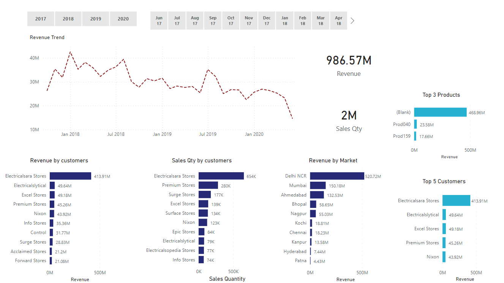
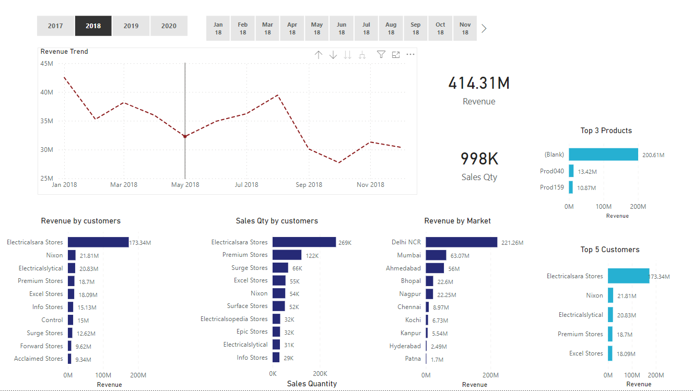

# Sales Insights PowerBI Project



## Table of Contents

- [Introduction](#introduction)
- [Project Overview](#project-overview)
- [Data Sources](#data-sources)
- [Installation](#installation)
- [Usage](#usage)
- [Features](#features)
- [Screenshots](#screenshots)
- [Contributing](#contributing)
- [License](#license)

## Introduction

The Sales Insights PowerBI Project is a data visualization and analysis tool that provides valuable insights into the sales performance of a company. By leveraging Power BI, this project allows users to explore, analyze, and gain actionable insights from the sales data. Whether you are a sales manager, executive, or analyst, this project will empower you to make informed decisions and optimize sales strategies.

## Project Overview

The primary goal of this project is to present a comprehensive view of sales data through interactive dashboards and visualizations. The project covers various aspects of sales analysis, including but not limited to:

- Sales performance over time.
- Regional sales distribution.
- Top-selling products and categories.
- Sales trends and seasonality.
- Customer segmentation and behaviour analysis.
- Profitability analysis.

## Data Sources

To ensure the accuracy and relevance of the insights, the Sales Insights PowerBI Project utilizes data from multiple sources, including:

1. **Sales Transaction Data**: Contains detailed information about individual sales transactions, including sales date, product details, customer ID, and sales amount.

2. **Customer Data**: Provides customer-related information such as customer demographics, contact details, and customer categories.

3. **Product Data**: Includes product-specific details such as product names, categories, and prices.

All data used in the project is anonymized and sanitized to protect sensitive information.

## Installation

To run the Sales Insights PowerBI Project locally, follow these steps:

1. Clone the repository to your local machine.

```bash
git clone https://github.com/your-username/sales-insights-powerbi.git
```
2. Ensure you have Power BI Desktop installed on your system.

3. Open Power BI Desktop and navigate to 'Open' in the File menu.

4. Select the main report file (e.g., sales_insights.pbix) from the cloned repository.

The project is now ready to be explored in Power BI.

## Usage
1. Open the Power BI report file (sales_insights.pbix).

2. The report will load the data and populate the visualizations.

3. Interact with the dashboards and filters to explore various sales insights.

Use the drill-down features to get more granular details.

## Features
- The Sales Insights PowerBI Project offers the following key features:

- Interactive Dashboards: Explore data through visually appealing and interactive dashboards.

- Dynamic Filters: Easily filter data based on specific time frames, regions, products, and customer segments.

- Drill-Down Functionality: Get deeper insights by drilling down into specific visualizations.

- Sales Trends: Identify trends and seasonality patterns to understand sales performance better.

- Top Performers: Discover the top-selling products, regions, and customers.

## Screenshots


## Contributing
We welcome contributions to enhance the Sales Insights PowerBI Project. If you find any issues or have suggestions for improvements, please open an issue or submit a pull request.

## License
This project is licensed under the MIT License. Feel free to use, modify, and distribute the code following the terms of the license.
